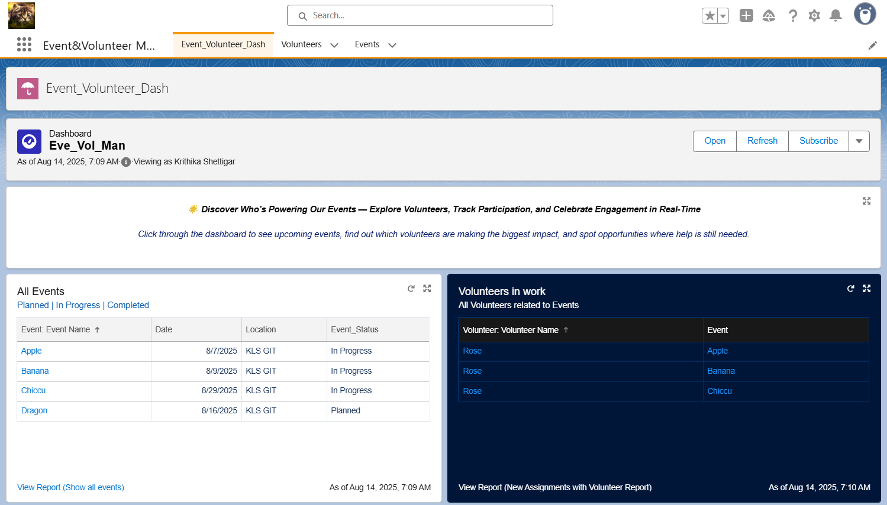

# Event & Volunteer Management – Salesforce

## Overview
This Salesforce application manages volunteers and events, and automatically assigns volunteers to events based on matching skills and availability. It eliminates manual event staffing and ensures optimal volunteer utilization.

## Features
- **Volunteer Registration Form**
  - Capture name, email, phone, skills, and availability.
  - Multi-picklist selection for multiple skills and time slots.

- **Event Creation Form**
  - Event name, date, location, and status (Planned, In Progress, Completed).
  - Required skills picklist for targeted volunteer assignment.

- **Automation**
  - Salesforce Flow automatically assigns volunteers to events when their skills and availability match the event requirements.

- **Dashboards**
  - Track events, volunteer participation, and assignment.

## 🛠Tech Stack
- Salesforce Lightning
- Custom Objects & Fields
- Multi-Picklist Fields
- Record Pages
- Salesforce Flow (Automation)

## Project Structure
- **Volunteers Object** – Stores volunteer details.
- **Events Object** – Stores event details.
- **Assignment Flow** – Matches and assigns volunteers automatically.
- **Dashboards** – For analytics and monitoring.

## Benefits
- Eliminates manual matching process.
- Ensures correct volunteers are assigned to relevant events.
- Saves time and improves operational efficiency.

## Screenshots

